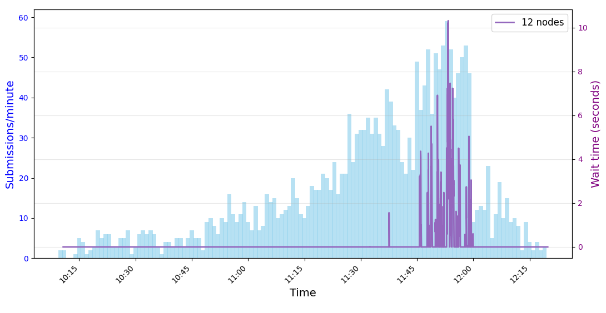

# Optimizing Cloudlets for Faster Feedback in LLM-Based Code-Evaluation Systems - simulation scripts
This repository contains the python simulation scripts used in for validating the mathematical model used in this paper: Optimizing Cloudlets for Faster Feedback in LLM-Based Code-Evaluation Systems

### Figure 4: Queueing Delay and End-to-End Latency with 12 Processing Nodes

In Figure 4, we include a simulation with 12 processing nodes to validate the accuracy of our previous computations. Among the 2,119 submissions, the maximum queueing delay observed is approximately ~10.3 s. With 12 processing nodes, the queueing delay remains below 11 s throughout the contest. Given a maximum job evaluation time of approximately 15 s, the resulting end-to-end user-perceived latency—defined as the sum of queueing delay and evaluation time—remains below 25 s. In addition, we overlay the same submission frequency shown in Figure 1 over the contest duration to visualize the submission workload for a contest with 200 participants.

